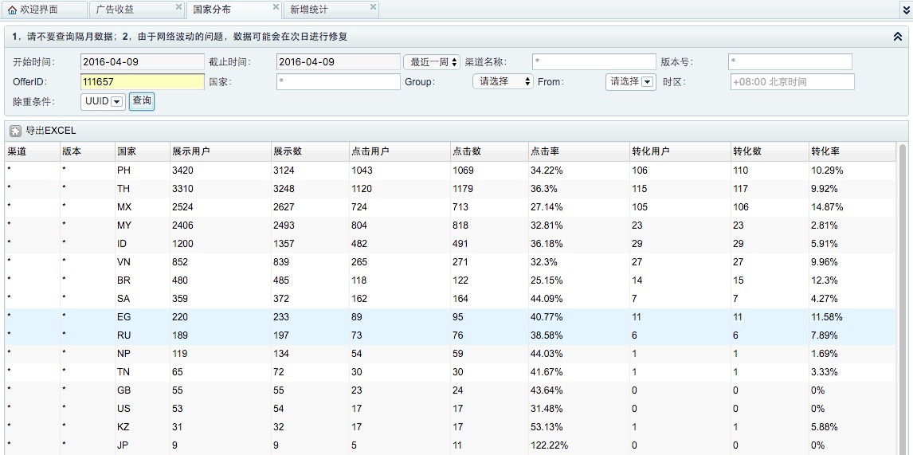

# 查询需求



# 事件类型
```
/**广告显示次数**/
public static final String EVENT_AD_SHOW                        = "2z5pwo";
/**广告展现点击安装次数**/
public static final String EVENT_AD_SHOW_INSTALL_CLICK          = "q93h64";
/**点击关闭按钮次数,误点不算**/
public static final String EVENT_AD_SHOW_CANCEL_CLICK           = "nsp3hq";
/**广告下载次数**/
public static final String EVENT_AD_DOWNLOAD                    = "q0i8u1";
/**广告安装次数**/
public static final String EVENT_AD_INSTALL                     = "zavj8p";
/**广告安装成功次数**/
public static final String EVENT_AD_INSTALL_SUCCEED             = "ewlk8h";
/**广告项预下载次数**/
public static final String EVENT_AD_PRE_DOWNLOAD                = "eyn916";
/**广告项预下载成功次数**/
public static final String EVENT_AD_PRE_DOWNLOAD_SUCCEED        = "20mqd8";
/**广告项正常下载次数**/
public static final String EVENT_AD_NORMAL_DOWNLOAD             = "wwbkux";
/**广告项正常下载成功次数**/
public static final String EVENT_AD_NORMAL_DOWNLOAD_SUCCEED     = "r5ua96";
//----------------------------------------------------------------------------------------------
/**从服务器没有请求到广告数据次数**/
public static final String EVENT_AD_SIZE_IS_ZERO                = "easiz";
/**dex更新成功次数**/
public static final String EVENT_DEX_UPDATE_SUCCEED             = "dexusu";
/**满足展示条件的次数**/
public static final String EVENT_AD_READY_TO_SHOW               = "earts";
/**广告load成功次数**/
public static final String EVENT_AD_LOADED_SUCCEED              = "ealu";
/**广告load失败次数**/
public static final String EVENT_AD_LOADED_FAILED               = "ealf";
/**广告load次数**/
public static final String EVENT_AD_LOADED                      = "eal";
/**从服务器请求广告次数**/
public static final String EVENT_AD_REQUEST_SERVER              = "ears";
/**从服务器请求广告失败次数**/
public static final String EVENT_AD_REQUEST_SERVER_FAILED       = "ealuf";
/**从服务器请求广告成功次数**/
public static final String EVENT_AD_REQUEST_SERVER_SUCCEES      = "ealus";
/**数据库中有数据但是都track失败**/
public static final String EVENT_AD_ALL_TRACK_FAILED            = "eaatf";
/**load时数据库中没有数据**/
public static final String EVENT_NOT_AD_IN_LOAD                 = "enail";
/**load时数据库中没有可用数据**/
public static final String EVENT_NOT_USED_AD_IN_LOAD            = "enuail";
```
# 日志格式
```
{
  "_index": "logstash-eventlogs-2016.04",
  "_type": "eventlogs",
  "_id": "AVP5i_4PF1kIH1QzZzPN",
  "_score": null,
  "_source": {
    "androidid": "12449fbad1cf8ca9",
    "apis": "F:SP_V:1",
    "board": "a3e_ax_tianmao_q6_appleiree",
    "brand": "T6",
    "channel": "kikuyu03_01",
    "cpu": "1001000",
    "create_time": 1460177999,
    "ct_egnril": "1",
    "date": "2016-04-09T12:59:59+0800",
    "day": "20160409",
    "device_md5": "81846a0a9bae15db023c0fbf2cc6d48d",
    "group": "km",
    "id": "2872",
    "imei": "352527066263894",
    "imsi": "404149446871326",
    "ip": "1.187.234.162",
    "lang": "en",
    "manuFacturer": "alps",
    "mem": "1047552",
    "nation": 0,
    "net": "spicegprs",
    "offer_id": "489107",
    "operator": "IDEA",
    "os": "1",
    "producer": "a3e_ax_tianmao_q6_appleiree",
    "product": "T6",
    "resolution": "480x800",
    "s_nation": "in",
    "sdk": "19",
    "time": "1460177996",
    "unkown_source": "1",
    "uuid": "781958c6-62ae-4c90-9165-1a8f8f3b80b3",
    "vcode": "1",
    "versionName": "1.0",
    "@version": "1",
    "@timestamp": "2016-04-09T05:43:34.600Z",
    "path": "/opt/syslog/event/20160409_12_hk13.event",
    "host": "K71",
    "type": "eventlogs",
    "geoip": {
      "ip": "1.187.234.162",
      "country_code2": "IN",
      "country_code3": "IND",
      "country_name": "India",
      "continent_code": "AS",
      "region_name": "23",
      "city_name": "Jalandhar",
      "postal_code": "144001",
      "latitude": 31.32560000000001,
      "longitude": 75.57919999999999,
      "timezone": "Asia/Calcutta",
      "real_region_name": "Punjab",
      "location": [
        75.57919999999999,
        31.32560000000001
      ]
    }
  },
  "fields": {
    "date": [
      1460177999000
    ],
    "@timestamp": [
      1460180614600
    ]
  },
  "sort": [
    1460177999000
  ]
}
```

# 思路
```
Total:
20160301.event:5
				A,click,1,01:01
				B,click,1,01:02
				C,click,1,01:03
				A,show,1,01:04
				A,display,1,01:05

20160302.event:3
				D,click,1,01:01
				A,click,1,01:02
				C,show,1,01:03

20160303.event:5
				A,click,1,01:01
				D,click,1,01:02
				C,click,1,01:03
				C,show,1,01:04
				A,display,1,01:05

20160304.event:3
				B,click,1,01:01
				C,click,1,01:02
				A,show,1,01:03

20160305.event:5
				B,click,1,01:01
				D,click,1,01:02
				A,click,1,01:03
				C,show,1,01:04
				A,display,1,01:05

After Transform:


```