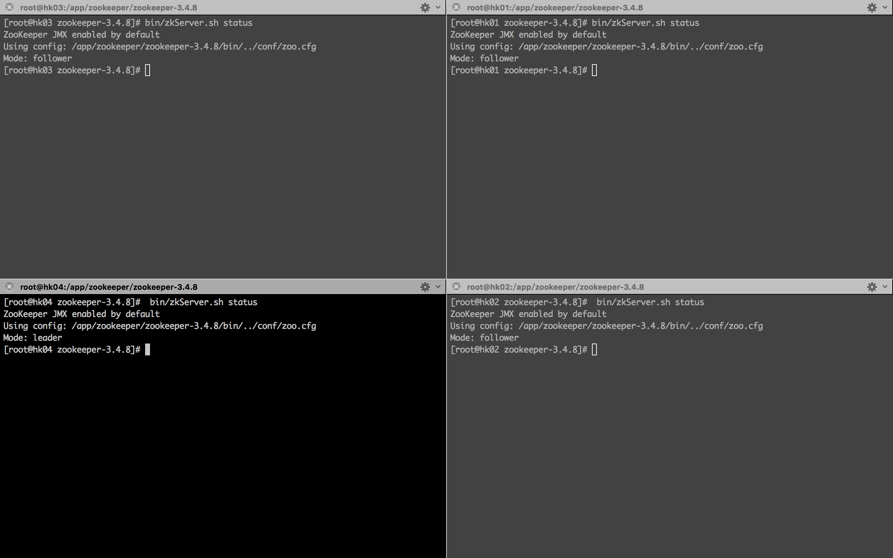

# 金石大数据日志分析平台

## 搭建 zookeeper 集群

### 软件版本
* Zookeeper: zookeeper-3.4.8

### 集群搭建

#### 第一步：添加各节点的主机名称到IP地址映射配置
```
10.254.131.4	hk01
10.254.130.5	hk02
10.254.132.229	hk03
10.254.128.237	hk04
```
##### 整个集群的架构可以参考[这里](http://zookeeper.apache.org/doc/trunk/zookeeperOver.html#sc_designGoals)

#### 第二步：在各节点创建ZooKeeper配置文件/opt/app/zookeeper/zookeeper-3.4.8/conf/zoo.cfg, 并添加以下内容到配置文件中
```
tickTime=2000  
dataDir=/opt/app/zookeeper/data
clientPort=2181  
initLimit=5  
syncLimit=2  
server.1=hk01:2888:3888  
server.2=hk02:2888:3888  
server.3=hk03:2888:3888 
server.4=hk04:2888:3888 
```
##### 上述配置内容说明，可以参考[这里](http://zookeeper.apache.org/doc/trunk/zookeeperStarted.html#sc_RunningReplicatedZooKeeper)
#### 第三步：设置myid 
##### 在我们配置的dataDir指定的目录下面，创建一个myid文件，里面内容为一个数字，用来标识当前主机，conf/zoo.cfg文件中配置的server.X中X为什么数字，则myid文件中就输入这个数字

#### 第四步：启动ZooKeeper集群，在各节点的zookeeper程序根目录下执行：
```
$ZOOKEEPER_HOME/bin/zkServer.sh start
```
#### 第五步：验证
##### 在各节点的zookeeper程序根目录下执行以下命令，查看启动状态，包括集群中各个结点的角色（或是Leader，或是Follower）
```
$ZOOKEEPER_HOME/bin/zkServer.sh status
```

#### 效果图


### 常用命令
```
# 开启集群
$ZOOKEEPER_HOME/bin/zkServer.sh start
# 关闭集群
$ZOOKEEPER_HOME/bin/zkServer.sh stop
# 查看集群状态
$ZOOKEEPER_HOME/bin/zkServer.sh status
# 启动客户端
$ZOOKEEPER_HOME/bin/zkCli.sh
# 查看日志
cat $ZOOKEEPER_HOME/zookeeper.out
```

### 复制文件
```
scp -r root@203.12.202.66:/opt/app/zookeeper/zookeeper-3.4.8/bin/zkServer.sh conf/zookeeper/
scp -r root@203.12.202.66:/opt/app/zookeeper/zookeeper-3.4.8/zookeeper.out conf/zookeeper/
```
### 常见错误
```
# 1.$ZOOKEEPER_HOME/bin/zkServer.sh status 之后提示zookeeper没有启动
# cat $ZOOKEEPER_HOME/zookeeper.out 之后发现java.net.NoRouteToHostException: 没有到主机的路由
# 最终解决方案为:到云平台打开2181,2888,3888这几个zookeeper使用到的端口
```